# 종목 선정 대시보드

평가 기준서(`docs/korean-stock-scoring-framework.md` v1.0)대로 KOSPI·KOSDAQ 전 종목을 매일 채점하고, 브라우저에서 보는 웹 프로그램입니다. Windows, macOS, Linux 어디서나 같은 방식으로 실행됩니다.

## 1. 설치·실행

1. Python 3.10 이상을 설치합니다 (Windows는 설치 화면에서 "Add python.exe to PATH"를 체크하세요).
2. 이 폴더를 내 컴퓨터에 둡니다.
3. 실행합니다.
   - Windows: `run.bat` 더블클릭
   - macOS/Linux: 터미널에서 `./run.sh`
4. 브라우저가 열립니다: http://127.0.0.1:5000 . 처음 한 번은 패키지 설치 때문에 몇 분 걸립니다.

휴대폰에서 보려면 `run.bat --host 0.0.0.0` 로 실행한 뒤, 같은 와이파이에서 `http://<PC의 IP>:5000` 으로 접속하세요.
Docker를 쓰면: `docker build -t stockapp . && docker run -p 5000:5000 -v $(pwd)/data:/app/data stockapp`

실행 옵션: `--port 5001`(포트 변경), `--no-browser`(브라우저 자동 열기 안 함), `--scan`(화면 없이 스캔 1회 실행 후 종료), `--demo`(가상 데이터로 스캔).

## 2. 무료 데이터 연결 (설정 메뉴)

| 데이터 | 가입처 | 쓰이는 항목 |
|---|---|---|
| 시세·거래대금·외국인/기관 수급·PER/PBR/배당 | 한국거래소 [data.krx.co.kr](https://data.krx.co.kr) 무료 회원 (아이디/비밀번호 입력) | 단기 대부분, M07·M09·M13~M15, L10·L16·L20 |
| 분기·연간 재무제표, 사업보고서 현금흐름표·차입금 | 금융감독원 [OpenDART](https://opendart.fss.or.kr) 무료 인증키 | S14, M01~M04·M17·M21, L01·L03~L05·L08·L09·L11·L15, K3·K10 |
| 관리종목 목록·환율 | 가입 필요 없음 (FinanceDataReader) | K1(거래정지는 KRX 거래량), S18 |

계정과 키는 이 컴퓨터의 `data/stock.db`에만 저장됩니다. 환경변수 `KRX_ID`, `KRX_PW`, `DART_API_KEY`가 있으면 그 값이 우선합니다.

### 2-1. '지금 스캔'이 하는 일 (순서대로)

| 단계 | 내용 | 다시 받는지 |
|---|---|---|
| 1. KRX 로그인 | 설정의 아이디·비밀번호로 로그인 상태 확인 | 매번 |
| 2. 거래일·지수 | KOSPI·KOSDAQ 지수 6년치 (pykrx, 실패 시 FinanceDataReader). 마지막 거래일이 **기준일** | 매번 호출 2~4회. 단, DB에 쌓인 구간은 빼고 마지막 저장일 10일 전부터만 받음 |
| 3. 일별 시세 | 최근 300거래일의 전 종목 시가·고가·저가·종가·거래량·거래대금. 날짜당 1회 호출 | **DB에 없는 날짜만**. 첫 실행 약 300회, 이후 하루 1회. 최근 10거래일 중 그날 20:30 전에 받은 날(장중 스캔)은 확정치로 다시 받음 |
| 4. 종목 정보·밸류에이션 | 기준일의 시가총액·상장주식수, PER·PBR·EPS·BPS·배당수익률·DPS, 업종 분류 (시장별) | 기준일당 한 번 (아래 설명) |
| 5. 수급 | 종목별 외국인 5·20일, 기관 20·60일, 연기금 20일 순매수 금액, 시장 전체 외국인 20일 순매수 | 기준일당 한 번 |
| 6. 외국인 지분율 | 기준일, 약 3개월 전, 약 6개월 전 | 과거 날짜는 DB 보관, 기준일 값은 기준일당 한 번 |
| 7. 과거 밸류에이션·배당 | 최근 5년 분기말 PBR, 연도별 DPS 표본 (L10·L16) | **한 번 받으면 재사용** |
| 8. 5년 전 상장주식수 | L20 희석 이력. 5년 전 무렵의 분기말 거래일 값 | 한 번 받으면 재사용 (분기마다 1회) |
| 9. 관리종목·환율 | KRX 관리종목 목록(K1), 원/달러 환율 90일(S18) | 기준일당 한 번 |
| 10. DART 재무 | 최근 3년 분기·반기·사업보고서 + 그 이전 4년 사업보고서 (주요계정, 100개 회사씩 묶어 조회) | 제출 기한이 지난 보고서는 재사용, 최근 보고서는 7일간 재사용, 회사코드 목록은 30일 |
| 11. DART 현금흐름표·차입금 | 회사별 사업보고서 전체 재무제표(최근 5개 연도분, 보고서 2~3개). 영업현금흐름, 유형·무형자산 취득, 감가상각비, 지배주주 순이익, 현금·차입금 (M17·M21·L09). 제외 필터 K7·K8·K9에 걸리는 종목은 받지 않음(보유 종목은 받음) | 받은 보고서는 다시 받지 않음. 아직 제출 전이던 최신 보고서만 7일 뒤 다시 확인 |
| 12. 채점·저장 | 현재 프로파일·평가 기준·가중치·수동 입력으로 전 종목 채점, 결과 저장 | - |
| 13. 재계산용 보관 | 이번에 모은 데이터 전체를 `data/last_bundle.pkl.gz`에 저장 | - |

- 일부 자료(수급, 업종, 환율 등)가 실패하면 그 항목만 N/A로 두고 계속 진행하며, 실패 내용은 대시보드와 스캔 기록에 경고로 남습니다. 일별 시세가 처음 5일 연속 실패하면 접속 문제로 보고 스캔을 멈춥니다.
- **기준일당 한 번**: 4~6·9단계는 그날 20:30(장 마감 20시 뒤) 이후에 받았으면 결과를 DB에 보관해, 같은 기준일로 다시 스캔해도 다시 받지 않습니다. 하나라도 실패했거나 20:30 전에 받았으면 보관하지 않고 다음 스캔에서 다시 받습니다.
- 첫 스캔은 1년치 시세와 7년치 재무, 회사별 현금흐름표를 받으므로 오래 걸립니다(대략 30~60분, 현금흐름표는 회사당 2~3회 조회). 현금흐름표는 1년에 한 번(새 사업보고서) 정도만 새로 받고, 다음 날부터는 3단계가 하루치만 받으므로 훨씬 빠릅니다. DART 일일 한도(2만 건)에 걸리면 받은 데까지 쓰고 다음 스캔에서 이어 받습니다.
- **프로파일·평가 기준·가중치·수동 점수만 바꿨다면 '지금 스캔' 대신 '재계산'**을 누르세요. 13단계에서 보관한 데이터로 다시 채점만 하므로 API 호출이 없습니다.
- 자동 스캔은 설정한 시각에 평일마다 같은 과정을 실행합니다. 프로그램이 켜져 있어야 하며, 컴퓨터를 켜 둘 수 없다면 Windows 작업 스케줄러나 cron으로 `python run.py --scan`을 평일 저녁에 실행하게 할 수도 있습니다.
- 처음 스캔하면 콘솔에 "KRX 로그인 실패: 환경 변수가 설정되지 않았습니다"가 한 번 보일 수 있습니다. pykrx가 불러와지는 순간 미리 로그인을 시도하기 때문이며, 바로 다음 단계에서 정상 로그인됩니다.

### 2-2. 투자검증의 '지금 스캔'

투자검증 화면의 '지금 스캔'은 위 과정을 **고른 기준일 시점**으로 실행합니다.

- 기준일 이전 마지막 거래일을 실제 기준일로 쓰고, 그날 이전 300거래일 시세와 그날 시점의 시가총액·수급·지분율·재무를 받습니다.
- 기준일 다음 날부터 오늘까지의 일별 시세도 받아 이후 수익률을 계산합니다.
- 재무는 기준일에 실제로 공시돼 있었을 보고서만 씁니다(분기·반기 47일, 사업보고서 90일 제출 기한 기준). 현금흐름표는 기준일이 4월 10일 이후면 직전 연도, 그 전이면 전전 연도 사업보고서부터 씁니다.
- 과거 관리종목 목록은 무료로 구할 수 없어 받지 않습니다. K1은 기준일 거래량 0(거래정지)으로만 판정합니다.
- 받은 데이터는 `data/bt/기준일.pkl.gz`에 저장되어 '검증 계산'에서 다시 받지 않고 쓰입니다.

### 2-3. 저장 위치

| 파일 | 내용 |
|---|---|
| `data/stock.db` | 일별 시세, 캐시, 보유·제외 종목, 수동 점수, 스캔 기록·점수, 설정 |
| `data/last_bundle.pkl.gz` | 마지막 정기 스캔 데이터 (재계산용) |
| `data/bt/*.pkl.gz` | 투자검증 기준일별 데이터 (검증 계산용) |

백업할 때는 `data` 폴더를 통째로 복사하면 됩니다.

## 3. 화면

화면 캡처는 모두 가상(데모) 데이터입니다.

### 3-1. 대시보드

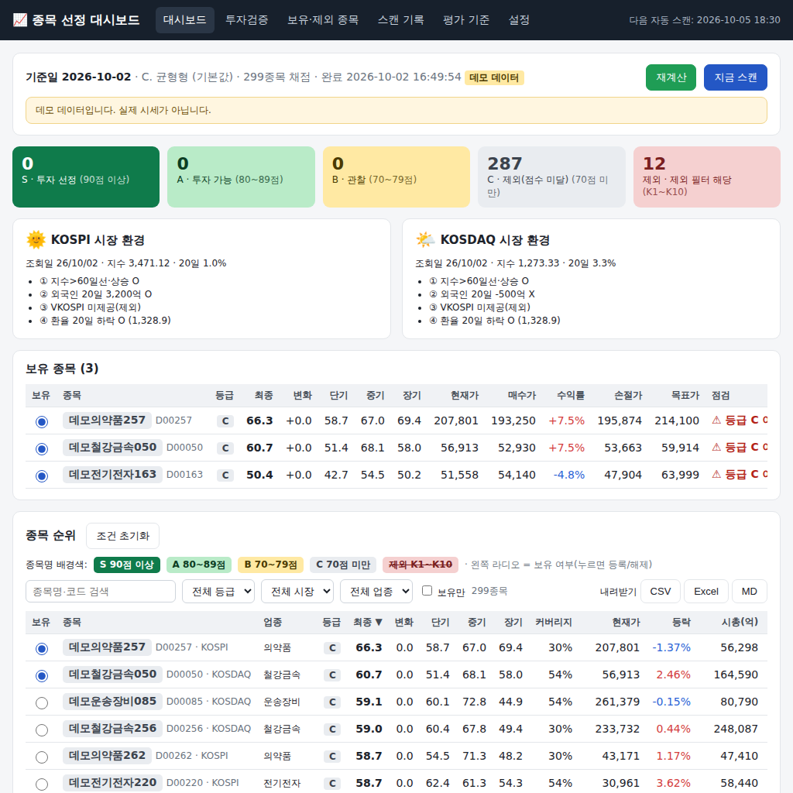

- **상단**: 기준일, 적용 프로파일, 채점 종목 수, 완료 시각. 버튼은 **재계산**(데이터 조회 없이 다시 채점)과 **지금 스캔**(2-1의 전체 과정). 스캔 중에는 진행 상황이 2초마다 갱신되고, 끝나면 화면이 새로 고쳐집니다. 새 스캔을 시작하면 이전 오류·경고는 지워집니다.
- **등급 칸**: S(90점 이상)·A(80~89)·B(70~79)·C(70 미만)·제외(K1~K10 해당) 종목 수. 칸을 누르면 아래 순위표가 그 등급으로 걸러집니다.
- **시장 환경**: 시장별 S18 점수를 날씨 그림으로 보여 줍니다. 10점 만점을 25%씩 나눠 🌞 좋음(7.5 이상), 🌤️ 보통(5 이상), ☁️ 주의(2.5 이상), 🌧️ 나쁨. 그림에 마우스를 올리면 글자로 보입니다. 아래에 조회일(YY/MM/DD), 지수, 20일 등락률과 조건별 충족 여부가 나옵니다.
  - 조건: ① 지수가 60일선 위이고 60일선 상승 ② 시장 외국인 20일 순매수 ③ VKOSPI(무료 데이터 없음, 제외) ④ 원/달러 환율 20일 하락. 충족 비율이 100%면 10점, 75% 이상 8점, 50% 이상 6점, 25% 이상 4점, 그 아래 2점이고, 지수가 20일간 10% 넘게 빠지면 0점입니다.
- **보유 종목**: 등급, 최종 점수, 직전 스캔 대비 변화, 관점별 점수, 현재가·매수가·수익률, 손절가·목표가와 점검 경고. 경고는 등급 C 이하, 제외 필터 해당, 현재가가 손절가 이하, 점수가 직전 대비 5점 이상 하락일 때 나옵니다.

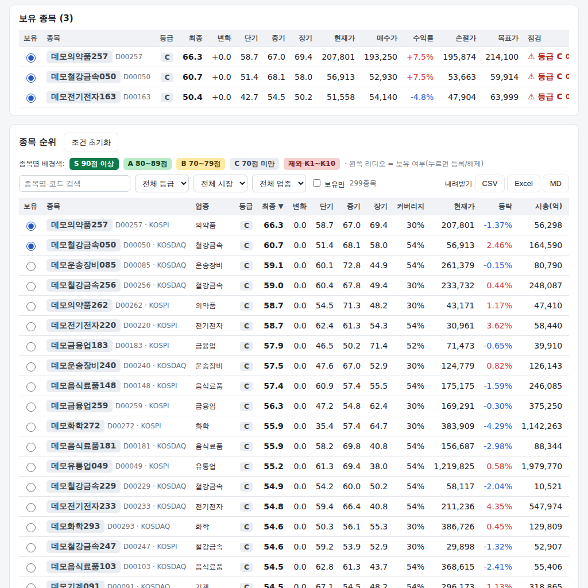

- **종목 순위**: 최종 점수순 전체 종목. 검색(종목명·코드), 등급(S+A, S+A+B 묶음 포함)·시장·업종·보유만 필터, 머리글을 눌러 정렬, 100개씩 페이지. 검색 조건과 정렬은 브라우저에 저장되어 다른 화면에 다녀와도 유지되고, '조건 초기화'로 되돌립니다.
- **종목명 배경색** = 등급(S 진한 초록, A 연초록, B 노랑, C 회색, 제외 붉은색 취소선). **왼쪽 라디오 버튼** = 보유 여부이며 누를 때마다 보유 등록/해제됩니다.
- **내려받기**: 지금 걸러지고 정렬된 그대로(페이지 구분 없이 전체) CSV(엑셀 한글 호환)·Excel(xlsx)·Markdown 파일로 받습니다.

### 3-2. 종목 상세

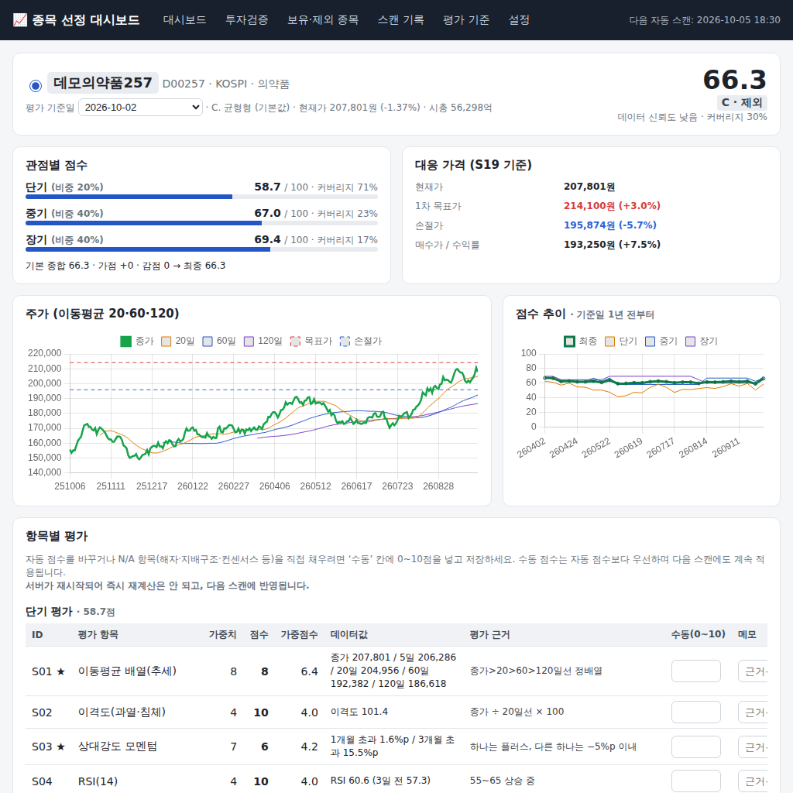

- **머리글**: 보유 라디오, 종목명(누르면 이전 화면으로 돌아감), 코드·시장·업종, 최종 점수와 등급, 데이터 신뢰도(커버리지 85% 이상 높음, 70% 이상 보통, 그 아래 낮음). 제외 필터·등급 게이트에 걸렸으면 이유가 붉은/노란 줄로 나옵니다.
- **평가 기준일**: 목록에서 다른 날짜(정기 스캔, 투자검증 기준일)를 고르면 그 시점의 평가로 바뀝니다.
- **관점별 점수**: 단기·중기·장기 점수(100점 환산)와 프로파일 비중, 관점별 커버리지, 기본 종합 → 가점·감점 → 최종 점수 계산 과정.
- **대응 가격 (S19 기준)**: 1차 목표가는 직전 60·120·252일 고점 중 현재가보다 3% 이상 높은 첫 고점(없으면 종가+3×ATR 추정), 손절가는 20일 최저가×0.99와 현재가×0.92 중 높은 값. 보유 중이면 매수가 대비 수익률도 나옵니다.
- **주가 차트**: 종가(녹색 굵은 선)와 20·60·120일 이동평균, 목표가·손절가 점선. 아래쪽 회색 막대는 일별 거래대금이고, 수치는 오른쪽 축(억 원)에 나옵니다. 마우스를 올리면 그날의 거래대금도 함께 보입니다.
- **점수 추이**: 1년 전부터 오늘까지 최종·단기·중기·장기 점수. 같은 날 여러 번 계산했으면 그날 마지막 값만 씁니다.

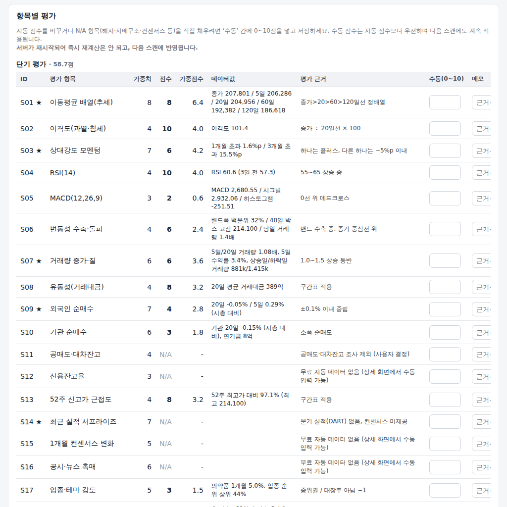

- **항목별 평가**: 62개 항목마다 가중치(사용자 값이 권장값과 다르면 "권장 N" 표시), 점수(N/A, 추정, 수동 표시), 가중점수, 데이터값, 평가 근거.
- **수동 입력**: '수동' 칸에 0~10점과 메모를 넣고 '수동 입력 저장'을 누르면 즉시 다시 계산되고, 이후 모든 스캔·재계산·검증 계산에도 계속 적용됩니다(자동 점수보다 우선). 칸을 비우면 수동 점수가 지워집니다. 가점(B1~B4)·감점(D1~D7)은 체크로 입력합니다. D4는 가격 조건(6개월 300% 급등)에 해당하면 '가격 기준 자동 해당' 표시와 함께 체크된 상태로 나오고, 체크를 풀고 저장하면 그 종목의 D4 감점을 끕니다.
- **돌아가기**: 이전 화면(검색 조건 그대로)으로 돌아갑니다.

### 3-3. 투자검증

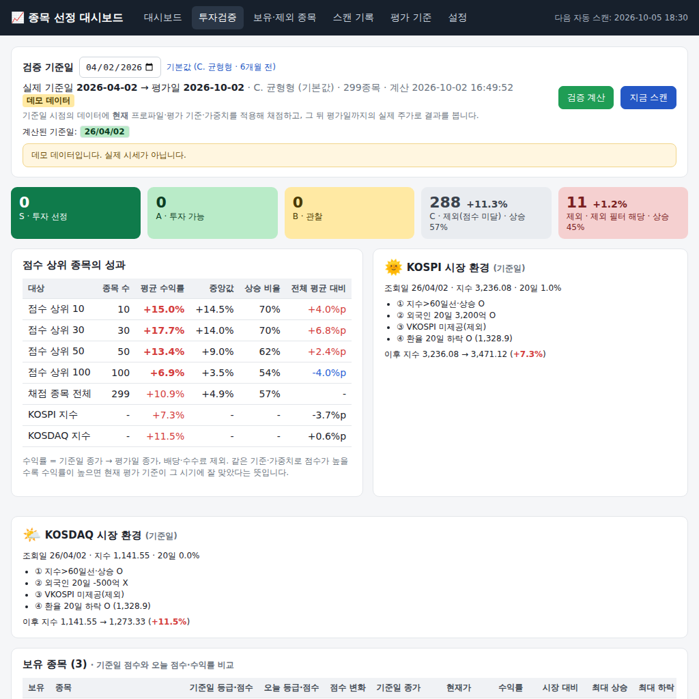

과거 기준일의 데이터에 **현재** 프로파일·평가 기준·가중치를 적용해 채점하고, 그 뒤 오늘까지의 실제 주가로 그 기준이 맞았는지 봅니다.

- **검증 기준일**: 날짜를 고르면 그 기준일 결과가 나옵니다. 기본값은 적용 중인 프로파일에 따라 U 10일 전, A 2개월 전, B 4개월 전, C 6개월 전, D 9개월 전입니다. 계산해 둔 기준일은 아래에 바로가기로 나옵니다.
- **지금 스캔**: 2-2의 과정으로 그 시점 데이터를 받아 계산합니다.
- **검증 계산**(녹색): 받아 둔 기준일 데이터로 계산만 합니다. 평가 기준을 바꾼 뒤 누르면 새 기준으로 다시 계산되고, 바뀐 뒤 아직 계산하지 않았으면 안내 문구가 나옵니다.
- 두 버튼 모두 기준일 점수와 함께 **기준일 다음 날부터 오늘까지의 점수**도 만듭니다(점수 추이용). 이후 거래일이 20일 이하이면 매일, 그보다 많으면 5거래일 간격입니다.
- **등급 칸**: 기준일 등급별 종목 수, 평균 수익률, 상승 종목 비율. 누르면 순위표가 그 등급으로 걸러집니다.
- **점수 상위 종목의 성과**: 기준일 점수 상위 10·30·50·100 종목의 평균·중앙 수익률, 상승 비율, 전체 평균 대비 차이와 KOSPI·KOSDAQ 지수 수익률. 점수가 높을수록 수익률이 높으면 지금의 평가 기준이 그 시기에 잘 맞았다는 뜻입니다.
- **시장 환경**: 기준일의 시장 환경과 그 뒤 지수 변화.

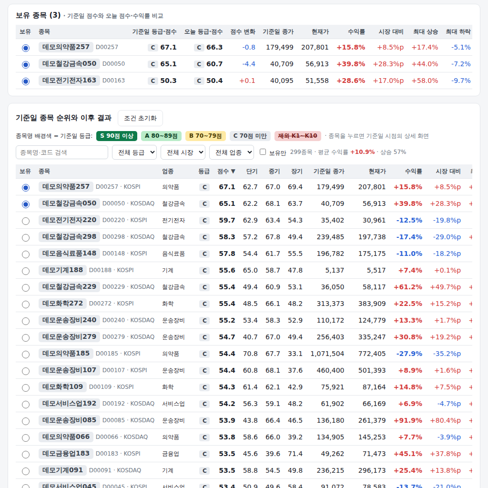

- **보유 종목**: 지금 보유로 등록한 종목의 기준일 등급·점수 → 오늘 등급·점수, 점수 변화, 기준일 종가 → 현재가, 수익률, 시장(지수) 대비, 기간 중 최대 상승·최대 하락. 손절가·목표가는 표시하지 않습니다.
- **기준일 종목 순위와 이후 결과**: 기준일 점수순 전체 종목과 수익률·시장 대비·최대 상승/하락·오늘 점수·점수 변화. 필터·정렬은 대시보드와 같고(검색 조건은 따로 저장), 위쪽에 걸러진 종목의 평균 수익률과 상승 비율이 나옵니다.
- 수익률은 기준일 종가 → 평가일(저장된 마지막 거래일) 종가이며 배당·수수료는 빠져 있습니다.

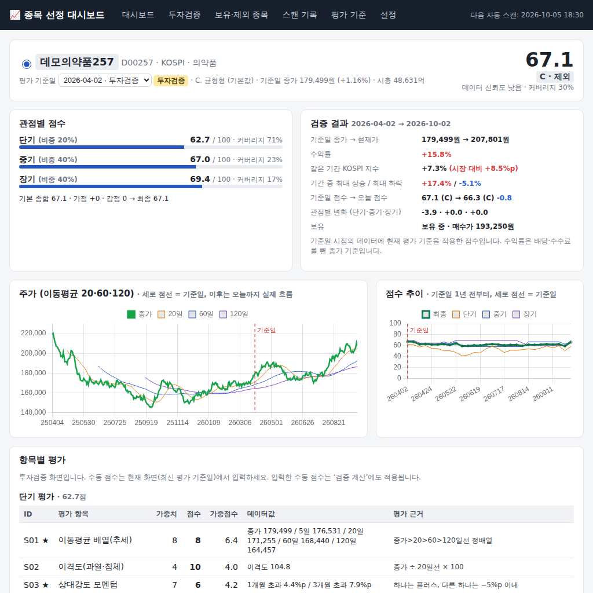

- 순위표의 종목을 누르면 **기준일 시점의 종목 상세**가 열립니다. '대응 가격' 대신 '검증 결과'(수익률, 같은 기간 지수, 최대 상승/하락, 기준일 점수 → 오늘 점수, 관점별 점수 변화)가 나옵니다.
- 주가 차트에는 기준일에 빨간 세로 점선이 그어지고, 종가와 이동평균선은 오늘까지 이어집니다. 점수 추이도 기준일 1년 전부터 오늘까지 보여 주며 기준일에 세로 점선이 있습니다.
- 이 화면에서는 수동 입력을 하지 않습니다(최신 기준일 화면에서 입력하면 검증 계산에도 적용됩니다).

### 3-4. 보유·제외 종목

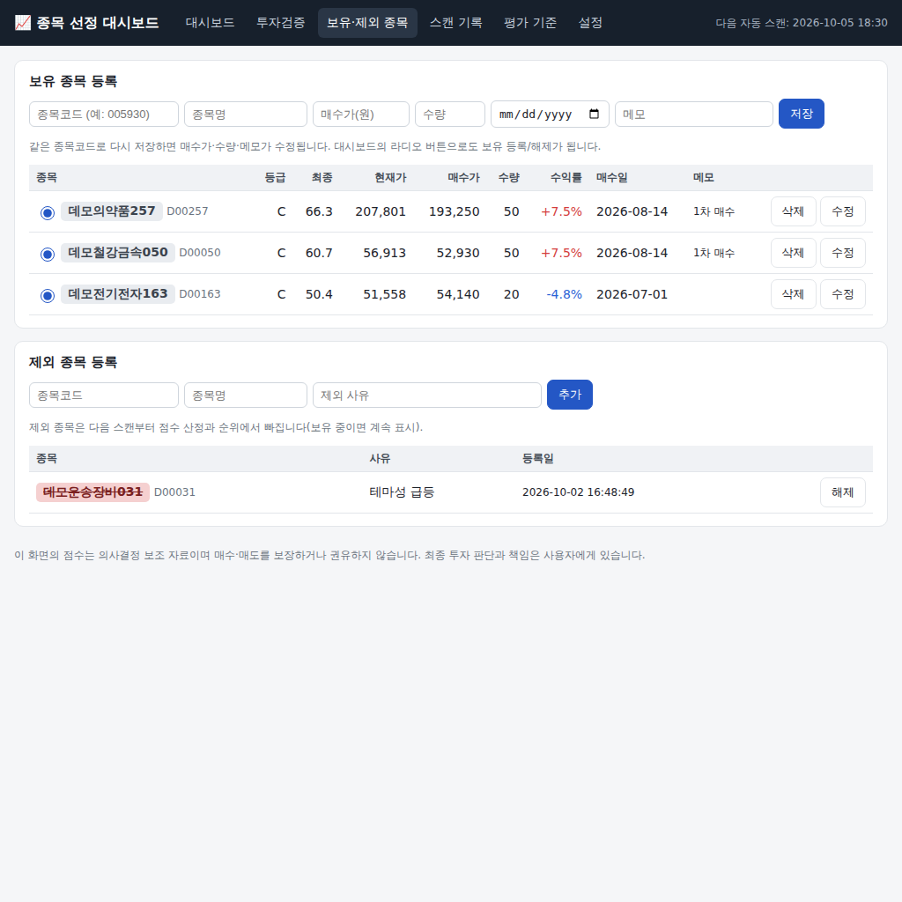

- **보유 종목 등록**: 종목코드(또는 종목명 입력 후 목록에서 선택), 매수가, 수량, 매수일, 메모. 같은 코드로 다시 저장하면 덮어씁니다.
- **보유 목록**: 최신 등급·점수·현재가·수익률. **삭제**와 **수정** 버튼이 있고, 수정을 누르면 그 줄의 매수가·수량·메모를 바로 고쳐 저장(Enter)하거나 취소할 수 있습니다.
- **제외 종목**: 제외 사유와 함께 등록하면 다음 스캔·재계산부터 채점과 순위에서 빠집니다(보유 중이면 계속 표시). 해제 버튼으로 되돌립니다.

### 3-5. 스캔 기록

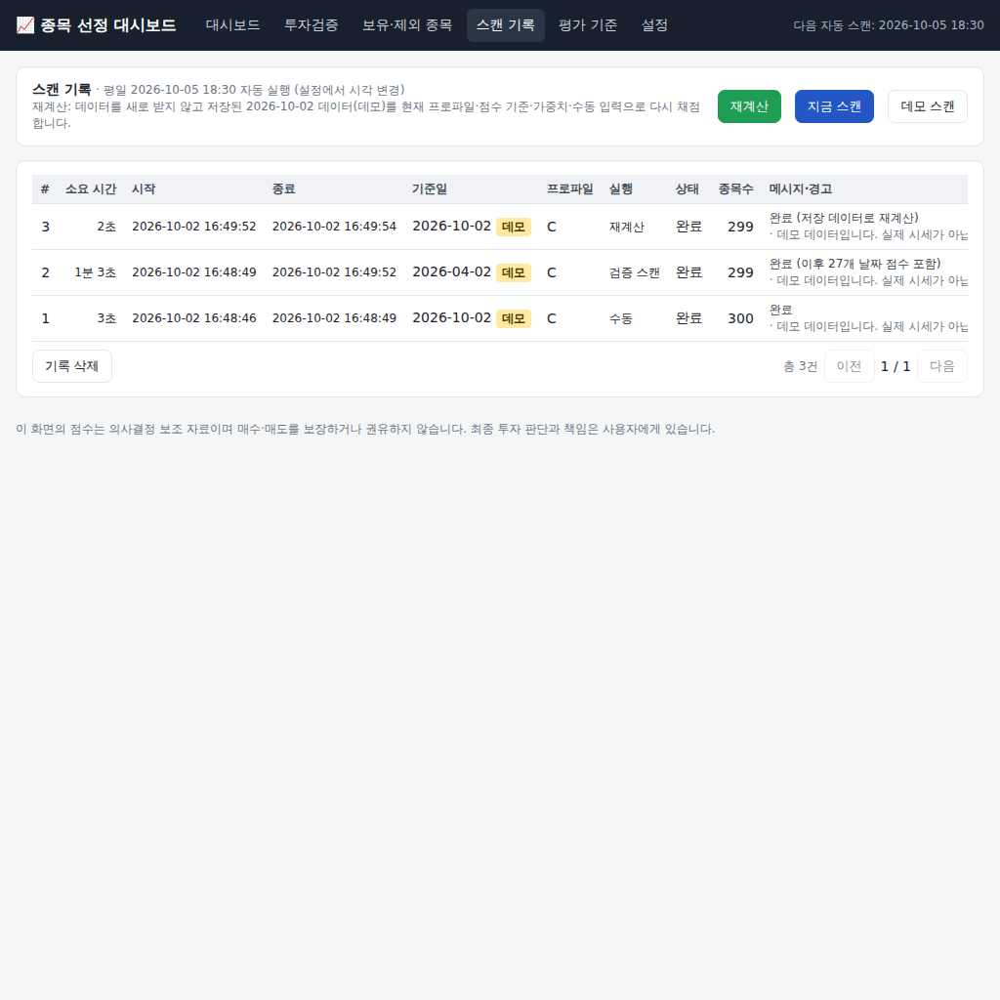

- **버튼**: 재계산(녹색), 지금 스캔, 데모 스캔(가상 데이터로 화면·기능 확인용).
- **재계산**: 마지막 정기 스캔 데이터를 현재 프로파일·평가 기준·가중치·수동 입력으로 다시 채점해 새 기록으로 남깁니다. 저장 데이터가 없으면 전체 스캔을 한 번 할지 묻습니다. 평가 기준·설정이 마지막 스캔 뒤에 바뀌었으면 안내 문구가 나옵니다.
- **목록**: 순번(#), 소요 시간, 시작·종료 시각, 기준일, 프로파일, 실행 구분(자동·수동·재계산·검증 스캔·검증 계산), 상태, 종목 수, 메시지·경고. 20개씩 페이지로 나눕니다.
- **기록 삭제**(왼쪽 아래): 시작한 지 1년이 지난 스캔 기록과 그 점수를 지웁니다. 진행 중인 스캔은 지우지 않습니다.
- 항목별 상세(종목 상세의 62개 항목 표)는 최근 60회 정기 스캔까지만 보관하고, 그보다 오래된 스캔은 점수만 남깁니다.

### 3-6. 평가 기준

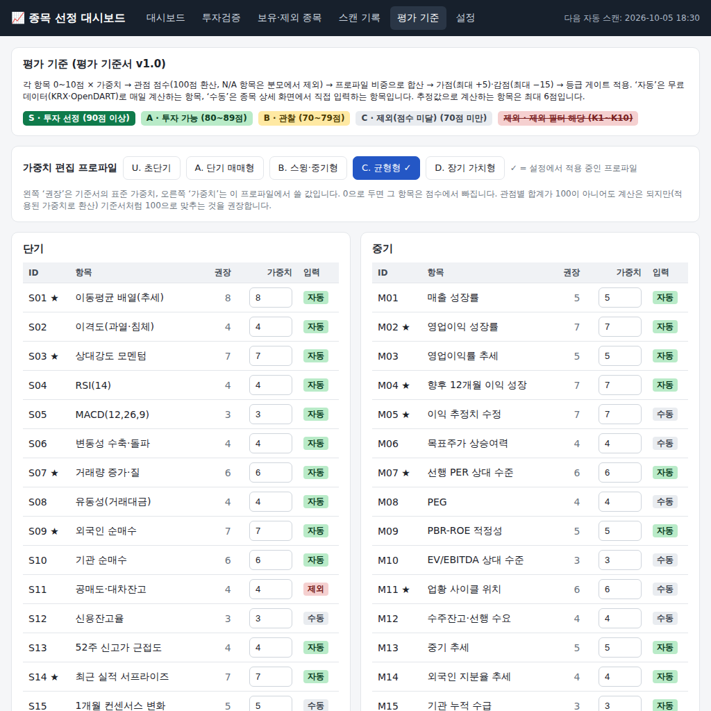

- 프로파일(U·A~D)을 골라 62개 항목의 **가중치**를 고칩니다. 왼쪽 '권장' 칸은 평가 기준서 값이고 오른쪽 칸이 실제 적용값입니다(0~50). '권장값으로 되돌리기'로 초기화합니다.
- 가중치를 0으로 하면 그 항목은 채점에서 빠집니다(분모에서도 제외).
- 항목마다 자동 계산 여부(자동·수동 입력만·조사 제외), 제외 필터(K1~K10), 가점·감점 목록도 보여 줍니다.
- 저장 후 안내 옆의 **지금 재계산**을 누르면 바로 점수에 반영됩니다.

### 3-7. 설정

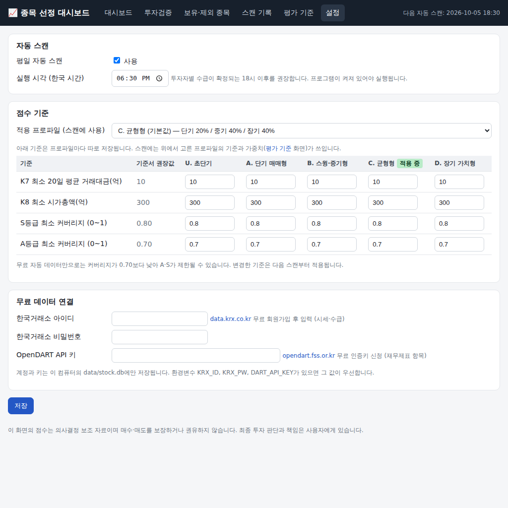

- **자동 스캔**: 사용 여부와 평일 실행 시각(한국 시간, 기본 20:30). KRX 장 종료가 20시이므로 투자자별 수급이 확정된 뒤인 20:30 이후를 권장합니다. 예전 기본값 18:30을 그대로 쓰던 경우 업데이트 후 첫 실행 때 20:30으로 바뀝니다.
- **점수 기준**: 스캔에 쓸 프로파일(U. 초단기 95·5·0, A 70·25·5, B 25·50·25, C 20·40·40 기본, D 5·30·65)과 프로파일별 기준값.
  - K7 최소 20일 평균 거래대금(억): 이보다 적으면 제외 필터 K7.
  - K8 최소 시가총액(억): 이보다 작으면 제외 필터 K8.
  - S·A등급 최소 커버리지(0~1): 90점 이상이어도 커버리지가 S 기준보다 낮으면 89점(A)으로, 80점 이상이어도 A 기준보다 낮으면 79점(B)으로 제한합니다. 낮추면 S·A 종목이 늘고, 높이면 수동 입력으로 데이터를 채운 종목만 S·A가 됩니다. 자동 데이터만으로는 커버리지가 보통 55~70%입니다(추정).
- **무료 데이터 연결**: KRX 아이디·비밀번호, OpenDART 키.
- 저장 후 '지금 재계산'을 누르면 데이터 조회 없이 바로 반영됩니다.

## 4. 평가 기준서와 다르게 처리한 부분 (무료 데이터 한계)

평가 기준서(`docs/korean-stock-scoring-framework.md`)와 실제 코드가 다르게 처리하는 부분을 모두 적었습니다.

### 4-1. 공통 산정 방식 (기준서 2장)

- **항목 점수**: 0~10 정수가 원칙이지만, 자동 규칙 일부는 기준서 구간 사이에 홀수 점수를 줍니다(S01 5·3점, S03 혼재 구간, S05 1점, S09 3·1점, S10 3점, M13 3점). 모든 점수는 0~10으로 잘립니다.
- **N/A**: 데이터가 없거나 자동 규칙이 없는 항목은 N/A로 두고 분모에서 뺍니다(기준서와 같음). 계산 중 오류가 나도 그 항목만 N/A가 됩니다.
- **수동 입력 우선**: 종목 상세에서 0~10(1점 단위)으로 넣은 점수가 자동 점수보다 우선합니다. 수동 점수에는 '추정 최대 6점' 제한이 걸리지 않습니다. 조사 제외 항목(S11)도 수동 입력하면 반영됩니다.
- **관점 점수**: `Σ(점수×가중치) ÷ Σ(적용 가중치) × 10` 공식은 같습니다. 다만 가중치는 기준서 권장값이 아니라 **프로파일별 사용자 가중치**(항목당 0~50, 기준 화면에서 수정)를 씁니다. 관점별 가중치 합이 100이 되는지는 검사하지 않습니다(기준서 15장은 100으로 맞추라고 함). 가중치 0인 항목은 분모·커버리지·핵심(★) 게이트에서 모두 빠집니다.
- **프로파일 U(초단기)**: 기준서에 없는 프로파일입니다. 단기 95% / 중기 5% / 장기 0%입니다. A~D 비중은 기준서와 같습니다.
- **단일 관점 요청**: 기준서의 "단기 관점만" 같은 단일 관점 모드는 없습니다. 활성 프로파일 하나가 모든 스캔에 적용됩니다.
- **관점 전체가 N/A일 때**: 기본 종합 점수는 점수가 있는 관점의 프로파일 비중만으로 다시 나눠 계산합니다(기준서에는 이 규칙이 없음). 이때 커버리지에는 그 관점이 0%로 들어갑니다.
- **커버리지**: 관점별로 `적용 가중치 ÷ 그 관점의 전체 가중치`를 구한 뒤, 전체 커버리지는 이 값을 **프로파일 비중으로 가중 평균**합니다. 기준서는 `적용 가중치 합 ÷ 전체 가중치(100)`이고 관점 간 합산 방법은 정하지 않았습니다.
- **데이터 신뢰도**: 85% 이상이면 높음, 70~85%면 보통, 70% 미만이면 낮음입니다. 기준서는 '70% 미만 = 낮음'만 정합니다.
- **사용자 조정 기준**: K7(거래대금 하한, 기본 10억), K8(시총 하한, 기본 300억), S게이트 커버리지(기본 80%), A게이트 커버리지(기본 70%)를 **프로파일별로** 설정에서 바꿀 수 있습니다. S08 거래대금 구간은 바꿀 수 없습니다(기준서 15장은 조정 가능).
- **가점·감점 한도와 최종 점수**: 가점 최대 +5, 감점 최대 −15, 최종 점수 0~100 제한은 기준서와 같습니다.
- **정렬**: 제외(X) 종목을 맨 뒤에 두고 최종 점수 → 핵심(★) 평균 순으로 정렬합니다. 동점일 때 ★ 평균을 쓰는 것은 기준서 12-2와 같습니다.
- **사용자 제외 목록**: 관리 화면의 제외 종목은 보유 종목이 아닌 한 채점하지 않습니다(기준서에 없는 기능). 시세가 20일 미만인 종목도 채점 대상에서 빠집니다.

### 4-2. 등급 게이트 (기준서 3-1)

- S 게이트(최종 90점 이상)의 조건은 기준서와 같습니다: 제외 필터, 최저 관점 점수 70 이상(프로파일 비중 10% 미만 관점 제외), 핵심(★) 2점 이하 없음, 커버리지 기준. 하나라도 못 넘으면 89점이 됩니다.
- A 게이트(최종 80점 이상)도 같습니다: 제외 필터, 핵심(★) 0점 없음, 커버리지 기준. 못 넘으면 79점이 됩니다.
- 차이 ①: 커버리지 하한이 고정 80%·70%가 아니라 프로파일별 설정값입니다.
- 차이 ②: 커버리지가 위 4-1의 프로파일 가중 평균입니다.
- 차이 ③: 핵심(★) 판정은 가중치가 0보다 큰 항목만 대상이고, N/A인 핵심 항목은 '2점 이하'나 '0점'으로 보지 않습니다.
- 자동 항목만으로는 커버리지가 보통 55~70%에 그칩니다(추정, M17·M21·L09 자동화로 약 6%p 상승). 그래서 수동 입력 없이는 A·S 등급이 나오기 어렵습니다.

### 4-3. 제외 필터 K1~K10 (기준서 4장)

기준서는 제외 대상이면 "채점하지 않고 제외"하라고 합니다. 앱은 **채점은 그대로 한 뒤** 등급을 X(제외 필터)로 표시하고 목록 맨 뒤로 보냅니다. K 항목은 수동 입력 칸이 없어서, 자동으로 못 잡는 항목은 사용자 제외 목록으로 대신해야 합니다.

| ID | 기준서 | 앱 처리 |
|---|---|---|
| K1 | 관리종목·실질심사·거래정지 | KIND 관리종목 목록(FinanceDataReader `KRX-ADMIN`)에 있으면 제외합니다. 실질심사 대상은 따로 보지 않습니다. 거래정지는 기준일 KRX 거래량이 0이거나 그날 시세 행이 없으면 해당으로 봅니다(정지 사유는 확인하지 않음). |
| K2 | 감사의견 비적정 | 자동 점검하지 않습니다. |
| K3 | 자본잠식률 50% 이상 | 최근 DART 재무상태표로 `(자본금 − 자본총계) ÷ 자본금`을 계산합니다(연결 우선, 없으면 별도). DART 키가 없으면 점검하지 않습니다. |
| K4 | 횡령·배임 미해소 | 자동 점검하지 않습니다. |
| K5 | 불성실공시 벌점 | 자동 점검하지 않습니다. |
| K6 | 투자위험종목 | 자동 점검하지 않습니다. |
| K7 | 20일 평균 거래대금 10억 미만 | KRX 거래대금 20일 평균으로 판정합니다. 하한은 프로파일별 설정값입니다. |
| K8 | 시총 300억 미만 | 기준일 KRX 시가총액으로 판정합니다. 하한은 프로파일별 설정값입니다. |
| K9 | 합병 전 SPAC | 종목명에 '스팩' 또는 'SPAC'이 들어 있으면 제외합니다(이름 기준). |
| K10 | 관리종목 요건 근접(기술특례 예외) | DART 연간 영업이익이 최근 3년 연속 적자이면 제외합니다. 시장(KOSPI·KOSDAQ) 구분이나 최신 상장규정은 반영하지 않습니다. 기술특례 예외는 자동으로 하지 않습니다(수동 확인). |

### 4-4. 항목별 처리

처리 구분:
- **자동**: 무료 데이터로 계산합니다.
- **자동(추정, 최대 6점)**: 대체 지표로 계산하고 '추정'으로 표시하며, 점수를 6점으로 제한합니다.
- **수동 입력만(N/A)**: 자동 규칙이 없습니다. 수동으로 입력하지 않으면 N/A로 분모에서 빠집니다.
- **조사 제외**: 사용자 결정으로 수집하지 않습니다.

| ID | 항목 | 처리 | 기준서와 다른 점 |
|---|---|---|---|
| S01★ | 이동평균 배열 | 자동 | 가격 130일 미만이면 N/A입니다. 20일선 상승은 '오늘 20일선 > 5거래일 전 20일선'으로 봅니다. 기준서 구간 사이에 5점(종가>20일선, 20<60)과 3점(60일선 아래, 20>60)을 추가했습니다. |
| S02 | 이격도 | 자동 | 기준서와 같습니다(종가 ÷ 20일선 × 100). |
| S03★ | 상대강도 | 자동 | 1개월은 21거래일, 3개월은 63거래일 수익률에서 소속 지수 수익률을 뺍니다. '시장 상위 10%'는 전 종목 1·3개월 수익률 백분위 평균 ≥ 0.9이면서 두 초과수익이 모두 플러스일 때입니다. 구간이 섞이면 사이 홀수 점수를 줍니다. |
| S04 | RSI(14) | 자동 | Wilder 방식 RSI입니다. 55~65인데 상승이 아니면 8점, 45~50인데 상승이 아니면 4점, 30 미만에서 반등하면 2점입니다. 상승 다이버전스(4점)는 자동으로 판정하지 않습니다. |
| S05 | MACD | 자동 | 히스토그램 축소(4점)를 골든크로스 후 10일(8점)보다 먼저 판정합니다. 0선 아래에서는 크로스 시점과 관계없이 MACD>시그널이면 6점입니다. 0선 위 정배열 유지 6점, 0선 아래 데드크로스·히스토그램 축소 1점은 기준서에 없는 구간입니다. |
| S06 | 변동성 수축·돌파 | 자동 | 가격 145일 미만이면 N/A입니다. 10점은 직전 5일 밴드폭 최저가 120일 하위 20%이고, 상단 돌파이며, 당일 거래량 2배 이상일 때입니다. 박스권은 3~42거래일 전 고점입니다. '수축 중'은 밴드폭 백분위 40% 이하이면서 20일 전보다 좁은 경우입니다. 0점은 하단 이탈과 거래량 1.5배 이상일 때입니다. |
| S07★ | 거래량 증가·질 | 자동 | 상승일·하락일 거래량은 최근 10일로 비교합니다. '상승 동반'은 5일 수익률 > 0입니다. 건전한 눌림은 거래량 비율 0.8 미만, 5일 −8~0%, 20일선 위일 때입니다. 분산 징후는 하락일 거래량이 상승일의 1.2배 초과일 때입니다. −2점 조건은 급증일(20일 평균의 2배)에 음봉 −3% 이상이거나 긴 윗꼬리가 나온 경우입니다. |
| S08 | 유동성 | 자동 | 구간은 기준서와 같습니다(KRX 거래대금). 사용자가 구간을 조정할 수는 없습니다. |
| S09★ | 외국인 순매수 | 자동 | KRX 투자자별 순매수 금액(5·20일)을 기준일 시총으로 나눕니다. 기준서에 없는 3점(20일 소폭 순매도 지속)과 1점(대규모 순매도 후 5일 매수)을 추가했습니다. 외국인·기관 20일 동반 순매수면 +1점입니다. |
| S10 | 기관 순매수 | 자동 | 기관합계 20일 순매수 ÷ 시총입니다. 10점은 연기금 20일 순매수가 플러스여야 합니다. 3점(소폭 순매도)을 추가했고, 동반 순매수면 +1점입니다. |
| S11 | 공매도·대차잔고 | 조사 제외 | 사용자 결정으로 수집하지 않으며 N/A입니다. 수동 입력은 반영됩니다. |
| S12 | 신용잔고율 | 수동 입력만(N/A) | 무료 자동 데이터가 없습니다. |
| S13 | 52주 신고가 근접도 | 자동 | 52주는 252거래일 **고가** 기준이고, 240일 미만이면 N/A입니다. 10점은 5일 내 신고가와 5일 평균 거래량이 직전 20일의 1.2배를 넘을 때입니다. |
| S14★ | 실적 서프라이즈 | 자동 | 컨센서스가 없어 항상 기준서의 대체 규칙(DART 분기 영업이익 YoY)을 씁니다. 그래서 최대 8점입니다. 흑자 전환은 8점, 적자(적자 지속 포함)는 0점입니다. |
| S15 | 1개월 컨센서스 변화 | 수동 입력만(N/A) | 컨센서스 데이터가 없습니다. |
| S16 | 공시·뉴스 촉매 | 수동 입력만(N/A) | 공시 내용을 해석하지 않습니다. |
| S17 | 업종·테마 강도 | 자동 | 업종 지수 대신 KRX 업종분류 종목들의 1개월 수익률을 시총 가중 평균해 순위를 냅니다(WICS 아님, 구성 종목 3개 미만이면 N/A). 대장주는 업종 내 시총 또는 20일 거래대금 상위 3위입니다. 하위 30%는 순위 백분위 0.7 이상입니다. 0점은 하위 10%이면서 업종 수익률이 마이너스일 때입니다. |
| S18 | 시장 환경 | 자동 | VKOSPI(③)는 빼고 ①②④ 세 조건 중 충족 비율로 환산합니다(3개 10점, 2개 6점, 1개 4점, 0개 2점). 그래서 기준서의 '3개 충족 = 8점'과 결과가 다릅니다. 0점은 지수 20일 −10% 이하일 때만이고 서킷브레이커·사이드카는 보지 않습니다. 시장(KOSPI·KOSDAQ)별로 따로 계산합니다. |
| S19 | 손익비 | 자동 | 목표가는 60·120·252일 고점 가운데 현재가보다 3% 넘게 높은 첫 값입니다(매물대 미사용). 손절가는 max(20일 최저가 × 0.99, 현재가 × 0.92)입니다. 저항선이 없으면(신고가권) 목표가를 '현재가 + 3×ATR'로 추정하고 이때만 최대 6점입니다. |
| S20 | 단기 수급 이벤트 리스크 | 수동 입력만(N/A) | 보호예수·CB/BW·시장경보 데이터가 없습니다. |
| M01 | 매출 성장률 | 자동 | DART 분기 매출 YoY입니다. TTM YoY는 10점 판정에만 씁니다. 업종 평균 대비 +1점은 적용하지 않습니다. |
| M02★ | 영업이익 성장률 | 자동 | '2개 분기 연속 증가'는 직전 분기 YoY도 플러스인지로 봅니다. 흑자 전환은 영업이익률 2% 이상이면 8점(의미 있는 규모), 아니면 6점입니다. 적자 폭이 줄면 4점입니다. |
| M03 | 영업이익률 추세 | 자동 | DART 분기 영업이익률의 YoY 변화입니다. 10점의 '3개 분기 연속 개선'은 최근 3개 분기 모두 YoY 개선일 때입니다. 금융업 NIM 대체는 하지 않습니다. |
| M04★ | 향후 12개월 이익 성장 | 자동(추정, 최대 6점) | 컨센서스가 없어 '최근 분기 순이익 × 4 ÷ TTM 순이익 − 1'로 추정합니다. EPS가 아니라 순이익(지배주주 구분 없음)입니다. |
| M05★ | 이익 추정치 수정 | 수동 입력만(N/A) | 컨센서스 데이터가 없습니다. |
| M06 | 목표주가 상승여력 | 수동 입력만(N/A) | 증권사 목표가 데이터가 없습니다. |
| M07★ | 선행 PER 상대 수준 | 자동(추정, 최대 6점) | 선행 대신 **후행 PER**(KRX) ÷ 업종 중앙값 PER(흑자 기업)입니다. EPS가 0 이하면 0점입니다. 6점으로 제한되므로 경기민감 보정(M11 4점 이하면 최대 6점)은 결과에 영향이 없습니다. |
| M08 | PEG | 수동 입력만(N/A) | 선행 PER·성장률 컨센서스가 없습니다. |
| M09 | PBR-ROE 적정성 | 자동(추정, 최대 6점) | 선행 대신 후행 ROE(KRX EPS ÷ BPS)를 씁니다. COE는 시총 5조 이상 8%, 1조 미만 10%, 그 사이 9%입니다. |
| M10 | EV/EBITDA | 수동 입력만(N/A) | EBITDA·순차입금을 수집하지 않습니다. |
| M11★ | 업황 사이클 | 수동 입력만(N/A) | 업종 선행지표가 없습니다. |
| M12 | 수주잔고 | 수동 입력만(N/A) | |
| M13 | 중기 추세 | 자동 | 가격 145일 미만이면 N/A입니다. 120일선 기울기는 20거래일 변화율이 +1% 초과면 상승, −1% 미만이면 하락입니다. 6개월은 126거래일 초과수익입니다. ±3% 근접(4점)을 10·8점보다 먼저 판정합니다. 120일선 위·하락은 4점, 아래·횡보는 3점을 추가했습니다. |
| M14 | 외국인 지분율 추세 | 자동 | KRX 외국인 지분율의 63거래일·126거래일 전 대비 변화입니다. 외국인 한도 업종도 한도 소진율이 아니라 같은 방식으로 판정합니다. |
| M15 | 기관 누적 수급 | 자동 | 기관합계 60거래일 순매수 ÷ 기준일 시총입니다. 구간은 기준서와 같습니다. |
| M16 | 주주환원·밸류업 | 수동 입력만(N/A) | |
| M17 | 이익의 질 | 자동 | 최근 12개월이 아니라 **최근 사업보고서 연간** 영업현금흐름 ÷ 지배주주 순이익입니다(없으면 당기순이익). 0점의 '영업현금흐름 2개 분기 이상 마이너스'는 분기 현금흐름이 없어 '연간 영업현금흐름 마이너스'로 판정합니다. 금융업은 N/A입니다. |
| M18 | 운전자본 이상 징후 | 수동 입력만(N/A) | 재고·매출채권을 수집하지 않습니다. |
| M19 | 정책·규제 영향 | 수동 입력만(N/A) | |
| M20 | 오버행 | 수동 입력만(N/A) | |
| M21 | 단기 재무 안정성 | 자동 | 순차입금/EBITDA 구간과 유동비율 구간 중 **낮은 점수**를 씁니다. 유동비율은 최근 분기 재무상태표, 순차입금(차입금·사채·리스부채 − 현금성자산·단기금융상품)과 EBITDA(영업이익 + 감가상각비·상각비)는 최근 사업보고서 연간 값입니다. 감가상각비를 못 찾으면 영업이익만으로 EBITDA를 대신하고, 차입금·영업이익이 없으면 유동비율만으로 판정하며 두 경우 모두 추정(최대 6점)입니다. 0점의 '단기차입금 만기 집중'은 보지 않습니다. 금융업은 N/A입니다. |
| L01★ | ROE 수준·안정성 | 자동 | DART 연간 '당기순이익 ÷ 기말 자본총계'(연결, 지배주주 구분 없음)이고 최근 3~5년입니다. 5년 미만이면 추정(최대 6점)입니다. 비금융 기업은 부채비율이 200%를 넘으면 ROE 수준과 관계없이 −2점입니다. |
| L02 | ROIC−WACC | 수동 입력만(N/A) | NOPAT·투하자본을 수집하지 않습니다. |
| L03 | 매출 장기 성장률 | 자동 | DART 연간 매출 CAGR입니다(최대 5년, 4개 연도 미만이면 N/A). 5년 미만이면 추정(최대 6점)입니다. 경기민감 업종의 고점 대비 고점 해석은 하지 않습니다. |
| L04★ | EPS 장기 성장률 | 자동(추정, 최대 6점) | 지배주주 EPS 대신 순이익 CAGR(3~5년)입니다. 최근 연도가 적자면 0점, 시작 연도가 적자면 2점입니다. 이상치 보정과 컨센서스 혼합은 하지 않습니다. |
| L05 | 영업이익률 수준·안정성 | 자동 | 3~5년 평균 영업이익률을 업종 중앙값(DART 자료가 있는 3개 사 이상)과 비교합니다. 8점은 표준편차 5%p 이하일 때(넘으면 6점), 업종 평균 수준(4점)은 0.85~1.0배, 그 미만은 2점입니다. |
| L06★ | 경제적 해자 | 수동 입력만(N/A) | |
| L07★ | 산업 구조적 성장성 | 수동 입력만(N/A) | |
| L08 | 재무구조 | 자동(추정, 최대 6점) | 이자보상배율 없이 부채비율(최근 DART 재무상태표)만으로 판정합니다. 금융업은 N/A입니다(CET1·K-ICS 대체는 수동 입력). |
| L09★ | FCF 창출력 | 자동 | FCF = 영업현금흐름 − 유형·무형자산 취득. 전환율 = 누적 FCF ÷ 누적 지배주주 순이익, 수익률 = 최근 연도 FCF ÷ 현재 시총입니다. 사업보고서 3~4개 연도만 있으면 추정(최대 6점), 3년 미만이면 N/A입니다. 'ROIC가 높으면(L02 8점 이상) +2점'은 적용하지 않습니다. 금융업은 N/A입니다. |
| L10 | 배당 지속성 | 자동 | KRX DPS 이력(매년 6월 표본, 약 5년)을 씁니다. 10년 연속·DPS CAGR·배당성향은 확인하지 않아 최대 8점(+1 가산 시 9점)입니다. 직전 대비 5% 넘게 줄면 '삭감'(2점)입니다. 무배당은 ROE(EPS÷BPS) 12% 이상이면 4점, 아니면 0점입니다. 배당수익률 4% 이상이면 +1점입니다. |
| L11 | 총주주환원율 | 자동(추정, 최대 6점) | 'DPS × 현재 상장주식수 ÷ DART 순이익'의 2~3년 평균입니다. 자사주 매입·소각은 반영하지 않습니다. |
| L12★ | 지배구조·대주주 리스크 | 수동 입력만(N/A) | |
| L13 | 소액주주 보호 | 수동 입력만(N/A) | |
| L14 | 경영진 자본배분 | 수동 입력만(N/A) | |
| L15★ | 안전마진 | 자동(추정, 최대 6점) | RIM 한 가지 방법만 씁니다(2가지 이상 아님). 'BPS + (ROE−COE) × BPS ÷ (COE−g)'에서 ROE는 DART 3년 평균(없으면 EPS÷BPS), COE는 8~10%(시총 기준), g는 1%입니다. |
| L16 | 역사적 밸류에이션 밴드 | 자동 | 선행 PER이 아니라 **PBR 밴드**이고, 약 5년간 분기말 표본입니다. 표본 12개(3년) 미만이면 N/A입니다(기준서는 최소 5년). '펀더멘털 훼손 없음'은 EPS > 0으로 대신 보며, 아니면 최대 8점입니다. 사업구조 변화에 따른 N/A는 자동으로 하지 않습니다. |
| L17 | R&D·설비투자 효율 | 수동 입력만(N/A) | |
| L18 | 고객 집중도 | 수동 입력만(N/A) | |
| L19 | 글로벌 경쟁력 | 수동 입력만(N/A) | |
| L20 | 주식 희석 이력 | 자동 | KRX 상장주식수를 약 5년 전과 비교합니다. −0.5% 미만이면 10점(감소)입니다. '3년 내 유상증자 2회 이상'은 보지 않고, 액면분할·병합도 보정하지 않습니다. |
| L21 | ESG·규제·소송 | 수동 입력만(N/A) | |

- 자동 37개 중 '추정' 판정은 다음과 같습니다.
  - 항상 추정: M04·M07·M09·L04·L08·L11·L15
  - 조건부 추정: S19(저항선 없을 때), L01·L03·L09(5년 미만일 때), M21(감가상각비나 차입금 자료가 없을 때)
- 수동 입력만인 항목은 24개, 조사 제외는 1개(S11)입니다.
- M17·M21·L09용 현금흐름표·차입금은 계정 이름과 IFRS 계정코드로 찾습니다. 회사마다 계정 이름이 달라 일부 회사는 값을 못 찾아 N/A가 될 수 있습니다.

### 4-5. 가점·감점 (기준서 8장)

- **B1~B4, D1~D3, D5~D7**: 모두 수동입니다. 종목 상세의 체크박스로 켜면 기준서의 점수(B +2/+1, D −2~−4)가 그대로 붙습니다.
- **D4**: 유일한 자동 항목입니다. 최근 126거래일 '최고 고가 ÷ 최저 저가 ≥ 4배'(300% 이상 상승)면 −3점입니다. '단일 테마' 여부는 보지 않고 가격만으로 판정합니다. 종목 상세에서 D4 체크를 풀고 저장하면 그 종목은 자동 감점을 하지 않고, 다시 체크하면 자동 판정으로 돌아갑니다. 가격 조건에 해당하지 않는 종목을 체크하면 수동 감점으로 붙습니다.
- 기준서 8장의 '이미 개별 항목에 반영한 사실은 가점·감점에 이중 반영하지 않는다'(예: M16과 가점)는 자동으로 점검하지 않습니다.

### 4-6. 업종별 대체 규칙 (기준서 9장)

- **금융업 판정**: KRX 업종명에 '금융·은행·보험·증권'이 들어 있으면 금융업으로 봅니다. 이때 바뀌는 것은 두 가지뿐입니다.
  - L08은 N/A로 둡니다(CET1·K-ICS·우발채무는 수동 입력).
  - L01의 부채비율 −2점을 적용하지 않습니다.
- 금융업의 나머지 대체 규칙은 구현하지 않았습니다: M03→NIM, M17→대손비용률, M01→CSM(보험), M11→거래대금·금리(증권), L11 핵심 취급. 그래서 M01·M03·L05 같은 일반 자동 항목이 금융업에도 그대로 계산됩니다.
- 금융업이면 M17·M21·L09도 N/A로 둡니다(기준서는 증권업의 M17·M21을 N/A로 두지 않지만 앱은 금융업 전체에 적용). M10·M18·L17은 원래 자동 규칙이 없어서 N/A입니다.
- **적자 바이오·기술특례**: 대체하지 않습니다. M07·L01·L04·L09 등이 N/A가 아니라 0점(또는 낮은 점수)으로 채점됩니다. 파이프라인·현금 런웨이 지표는 없습니다.
- **지주회사(NAV 할인율), 리츠(P/FFO·LTV 등), 적자 성장주(EV/Sales·Rule of 40)**: 구현하지 않았습니다.
- **경기민감 업종 M07 보정**: 별도 구현이 없습니다. M07이 추정이라 이미 최대 6점이어서 결과는 같습니다.
- 업종 대체 적용 여부를 결과에 표시하지 않습니다(기준서 12-1 '업종 대체 규칙' 칸 없음).

### 4-7. 데이터 처리 규칙 (기준서 10장)

- **N/A**: 데이터가 없으면 N/A로 둡니다. 업종에 맞지 않아서 N/A로 두는 경우는 금융업 L08 하나뿐입니다.
- **추정 최대 6점**: 자동 계산에 '추정' 표시가 붙으면 6점으로 제한합니다. 수동 입력 점수에는 추정 표시 기능이 없어 제한되지 않습니다.
- **커버리지·신뢰도**: 4-1과 같이 프로파일 가중 평균을 쓰고, 신뢰도는 3단계(85%·70% 경계)입니다.
- **기준일**: 가격·수급·밸류에이션은 직전 거래일 KRX 값입니다. 재무는 분기 종료(해당 월 28일) 후 40일이 지난 DART 보고서를 씁니다. 사업보고서도 40일 뒤부터 조회를 시도하며, 확정 전까지 7일마다 다시 받습니다. 현금흐름표·차입금(M17·M21·L09)은 4월 10일부터 직전 연도 사업보고서를 씁니다. 컨센서스는 쓰지 않습니다.
- **재무 계정**: DART 다중회사 주요계정(매출·영업이익·순이익·자본·부채·유동자산·유동부채·자본금)과, M17·M21·L09용 사업보고서 전체 재무제표(영업현금흐름·유형/무형자산 취득·감가상각비·지배주주 순이익·현금·차입금)를 씁니다. 연결이 있으면 연결, 없으면 별도입니다. 분기 실적은 누적값 차감으로 만들고(4분기 = 연간 − 3분기 누적), 주요계정 순이익은 지배주주 구분이 없습니다.
- **데이터 출처**: KRX(pykrx, 로그인 필요)를 쓰고, 지수는 실패하면 FinanceDataReader로 대체합니다. 관리종목은 KIND 목록, 환율은 FinanceDataReader, 재무는 OpenDART입니다. 증권사 리포트·컨센서스(FnGuide 등), 관세청, 한국ESG기준원, 업종 통계는 쓰지 않습니다.
- **중복 반영 금지**: 자동으로 점검하지 않습니다. S09·S10의 쌍끌이 각 +1점은 기준서 규정대로 둘 다 적용합니다.
- **가격 이력**: 최근 300거래일만 씁니다(`history_days`). 120일선·52주 계산에는 충분합니다.

### 4-8. 투자검증(백테스트)의 근사

- **기준일**: 사용자가 고른 날짜 이전의 마지막 거래일입니다. 그날까지 300거래일 시세로 채점하며, 가중치·K7/K8·게이트는 **현재 설정**을 씁니다.
- **수동 입력·목록**: 수동 점수(가점·감점 포함)와 보유·제외 목록도 **현재 저장된 값**이 과거 기준일에 그대로 적용됩니다. 그래서 미래 정보가 섞일 수 있습니다.
- **프로파일별 기본 검증 기간(기준서에 없음)**: U 10일, A 2개월, B 4개월, C 6개월, D 9개월 전입니다.
- **K1**: 과거 관리종목 목록이 없어 기준일 거래량 0(거래정지) 여부만 봅니다.
- **DART 공시 시차(strict)**: 실제 제출일이 아니라 기한으로 근사합니다. 분기보고서는 분기말(28일) + 47일, 사업보고서는 + 90일이 지나야 썼다고 봅니다(평소 스캔은 40일).
- **기준일 스냅샷**: 시총·PER·PBR·EPS·BPS·DPS, 수급(5·20·60일), 외국인 지분율, 업종분류, 환율, PBR·DPS 이력은 기준일 시점 값을 KRX·FinanceDataReader에서 받습니다.
- **기준일 이후 날짜별 점수**(점수 추이용, `_after_bundles`·`_score_after_days`)는 데이터를 새로 받지 않고 근사합니다.
  - 주가·거래량·지수: 그날까지의 실제 값
  - 시가총액: 기준일 상장주식수 × 그날 종가
  - PER·PBR: 주가 비율만큼 조정, 배당수익률은 반대로 조정
  - 그대로 두는 값: 외국인·기관 수급, 시장 외국인 수급, 외국인 지분율, DART 재무, 환율, EPS·BPS·DPS, PBR·DPS 이력
  - 관리종목 목록은 비워 둡니다.
  - 이후 거래일이 20일을 넘으면 가장 최근 거래일부터 5거래일 간격으로만 계산합니다.
  - 항목별 상세 없이 점수만 저장합니다.
- **수익률**: '평가일 종가 ÷ 기준일 종가 − 1'입니다. 배당·수수료·세금·슬리피지는 빠집니다. 최대 상승·하락은 장중 고가·저가가 아니라 종가 기준입니다. 이후 시세가 끊긴 종목은 마지막 종가로 계산합니다.
- **집계**: 시장 대비는 같은 기간 KOSPI·KOSDAQ 지수 수익률과 비교합니다. 등급별·상위 N개(10·30·50·100, 제외 X 빼고) 평균·중앙값·상승 비율을 냅니다.

## 5. 폴더 구조

```
run.py                   실행 진입점 (--scan, --host, --port, --no-browser)
stockapp/framework.py    항목·가중치·프로파일·등급 정의
stockapp/scoring.py      채점 규칙 (항목별 함수, 제외 필터, 게이트, 가점·감점)
stockapp/indicators.py   이동평균·RSI·MACD·볼린저밴드 등 기술 지표
stockapp/bundle.py       채점 입력 데이터 묶음(시세·수급·재무)
stockapp/collector.py    KRX 시세·수급·지수·환율 수집 (pykrx, FinanceDataReader)
stockapp/dart.py         OpenDART 재무 수집
stockapp/scanner.py      스캔·재계산·투자검증 실행과 저장
stockapp/verify.py       투자검증 수익률·집계
stockapp/export.py       종목 순위 내보내기 (CSV·XLSX·Markdown)
stockapp/db.py           SQLite 저장소 (data/stock.db)
stockapp/web.py          웹 화면·API·자동 스캔 스케줄러
stockapp/demo.py         화면 확인용 가상 데이터
stockapp/templates/      화면 HTML
stockapp/static/         스타일·아이콘
docs/                    평가 기준서, 화면 캡처
```

이 프로그램의 점수는 의사결정 보조 자료이며 손실이 없음을 보장하지 않습니다. 최종 투자 판단과 책임은 사용자에게 있습니다.
